# Vanilla

[](#installation)


**Vanilla** is a design system, delivered as a set of *skills*. Turn it on and the interfaces you build belong to the same visual family — instantly recognizable — while each product keeps its own layout and personality.

> **The skin is Vanilla; the soul is the product's.**

The *skin* (color, type, depth, icons) is fixed and guarantees recognition; the *soul* (domain, layout, hierarchy, and each product's *signature*) is free. Vanilla handles the *craft* — hierarchy, accessible primitives, polish, motion, states — so every UI ships with product quality, without looking "AI-generated."

These are plain `SKILL.md` skills, **portable across Claude Code and OpenCode** (no subagents, plugins, or environment-specific config).

---

## Contents

- [Concept](#concept)
- [The 7 skills](#the-7-skills)
- [The flow](#the-flow)
- [The skin](#the-skin)
- [Default stack](#default-stack)
- [Repository layout](#repository-layout)
- [Installation](#installation)
- [Usage](#usage)
- [Conventions](#conventions)
- [Development](#development)

---

## Concept

What is **non-negotiable** (the skin — identical across every project):

- Palette and color · **Inter** type · lavender accent (used sparingly)
- *Surface ladder* (canvas → surface-1..4) and *hairlines*
- Radius and spacing scales · **Lucide** icons
- **Headless primitives** for controls (Base UI in React, Reka UI in Vue) — never a styled UI kit

What is **free** (the soul — decided per product):

- Layout, composition, hierarchy, and focus · density within range
- Which screens/components exist · content and voice
- The **signature** — the one element that could only exist in *this* product

Rule of thumb: if the change alters *what the brand looks like*, it's skin (fixed). If it alters *what this product does/prioritizes*, it's soul (free).

---

## The 7 skills

| Skill | Role | When to use |
|---|---|---|
| **`vanilla`** | Hub / orchestrator | Entry point for building any product UI |
| **`vanilla-discovery`** | Interview the soul | At the start of a new project, before any code |
| **`vanilla-brand`** | Brand the skin per client | Once per company — capture their identity into `brand.css` |
| **`vanilla-build`** | Construction | Build or extend the UI from the brief |
| **`vanilla-review`** | Taste pass | Judge craft, family, and soul before merge |
| **`vanilla-audit`** | Evidence pass | Verify the measurable quality before merge |
| **`vanilla-direction`** | Extra character | When the product needs stronger visual personality |

### `vanilla` — the hub

The entry point. Loads the family (`design.md`, `tokens.css`, `theme.css`, `motion.md`) and runs the `discover → build → review & audit` flow (+ direction on demand), invoking the satellites in the right order. It's lightweight: it orchestrates, it doesn't duplicate.

### `vanilla-discovery` — the soul

A **short interview** that captures what makes the product unique: real user, task, domain, *feel*, **signature**, and stack (framework, Tailwind, theme). It persists everything to a **`vanilla-brief.md`** in the project's `docs/vanilla/`. This is the main **antidote to convergence** (the risk that every product comes out the same). On a new project, it offers `git init` before writing.

### `vanilla-brand` — the per-client skin

Run **once per client/company** to capture their visual identity — accent, neutrals, type, radii, density, elevation — into a **`brand.css`** in the project's `docs/vanilla/`. That file overrides only the `--vanilla-*` tokens the brand changes; everything else falls through to `tokens.css` (the default skin). It's the **values** layer, not the engine: a client that never runs it keeps the default Vanilla skin, and the engine (craft, headless primitives, the surface-ladder model, the flow) stays invariant. AA is enforced over the effective tokens by `vanilla-audit` (`contrast.mjs --brand`), which suggests a hue-preserving fix for any failing pair. Define once, inherit across every product for that client.

### `vanilla-build` — the construction

Builds the UI **from the brief**, applying the skin (tokens) with real *craft*: hierarchy (weight + color + ink ramp, not just size), the *surface ladder*, polish, motion < 300ms, complete states. Uses **headless primitives** (Base UI / Reka UI) and **Lucide** icons. Applies the **theme** (dark / light / both with a toggle + anti-FOUC script) and inherits the client's **`brand.css`** (from `vanilla-brand`) if the project has one.

### `vanilla-review` — the taste pass

A **strict** review against three bars:

1. **Craft** — would a design lead put their name on it? (hierarchy, restraint, polish)
2. **Family** — is it unmistakably Vanilla? (tokens, Inter, surface ladder, Lucide, primitives)
3. **Soul** — does it carry the brief's *signature*, or could it be any product?

Judges by default (reports findings + verdict, severity *Blocker / Should-fix / Note*); rebuilds only when you ask.

### `vanilla-audit` — the evidence pass

The *measurable* sibling of `vanilla-review`. Where review judges what only a person can, audit verifies what a machine can: **WCAG contrast** on both themes (via `references/contrast.mjs`), **token fidelity** (no hardcoded hex/px, no undefined vars, no off-scale type/space), responsive and touch targets, complete interaction/data states, and family-mechanical conformance (Lucide, headless primitives, surface ladder). Run **both** before merge — review for taste, audit for evidence. Reports findings by severity; fixes only when asked.

### `vanilla-direction` — the character

Invoked **on demand**, when the brief's *feel* asks for more personality. It decides **where to spend boldness within the fixed skin** — amplifying the signature, the layout, the motion, the density, and the expressive use of Inter — and spends it in one place. It never repaints the skin (a new color/font/icon set = a violation).

---

## The flow



<sub>Diagram source: [`assets/flow.mmd`](assets/flow.mmd) — regenerate with `npx -y @mermaid-js/mermaid-cli -i assets/flow.mmd -o assets/flow.svg -b "#010102"`.</sub>

1. **Discover** — the interview produces `vanilla-brief.md`. *This is where the soul lives.*
2. **Direction** *(optional)* — amplifies character within the skin.
3. **Build** — the UI is assembled on top of the skin, guided by the brief.
4. **Review & audit** — taste (`vanilla-review`) plus evidence (`vanilla-audit`). Ship only when both clear.

---

## The skin

The skin lives in `skills/vanilla/references/`:

- **`design.md`** — the semantic source (the "why" behind each decision).
- **`tokens.css`** — the canonical technical source: CSS custom properties (`--vanilla-*`).
- **`theme.css`** — the **Tailwind v4** preset (`@theme`) that *references* `tokens.css` (never redeclaring values).
- **`motion.md`** — the family's motion layer (curves, durations, the decision-before-how discipline).
- **`shells.md`** — app-shell archetypes (Console / Focused / Workbench / Reader / Canvas); structure starting points, not skin.
- **`contrast.mjs`** — the WCAG contrast checker over the tokens (used by `vanilla-audit`).

The `design.md → tokens.css → theme.css` chain makes Tailwind **inherit the skin at runtime**: change one value in `tokens.css` and it propagates everywhere, with no rebuild.

### Themes (dark / light)

Dark is the default and the family's face. Light is the **same skin inverted** (`:root[data-theme="light"]`): same Inter, same lavender (with the value tuned to pass AA), inverted surface ladder + shadows for elevation. Choose per project at discovery: **dark / light / both**. "Both" generates a toggle (Lucide sun/moon) with persistence and an anti-FOUC script (key `vanilla-theme`).

### Brand (per client)

A client's identity lives in a per-client **`brand.css`** generated by [`vanilla-brand`](#vanilla-brand--the-per-client-skin), not in the engine. It overrides only the `--vanilla-*` tokens the brand changes and is loaded **last** (`tokens.css` → `theme.css` → `brand.css`), so it wins by cascade with no rebuild; everything it omits falls through to the default skin. AA over the effective tokens is checked by `vanilla-audit` (`contrast.mjs --brand`), which suggests a hue-preserving fix for any failing pair. A project with no `brand.css` keeps the default Vanilla skin.

---

## Default stack

| Layer | Choice | Note |
|---|---|---|
| Type | **Inter** (+ JetBrains Mono) | Fixed part of the skin |
| CSS | **Tailwind v4** (`theme.css` preset) | Recommended, not required — without Tailwind, import `tokens.css` |
| Primitives | **Base UI** (React) · **Reka UI** (Vue) | Headless; never a styled UI kit (Material/Vuetify/Chakra/Ant) |
| Icons | **Lucide** | `lucide-react` / `lucide-vue-next` — same icons in both frameworks |

---

## Repository layout

```
skills/
├── vanilla/                  hub
│   ├── SKILL.md
│   └── references/
│       ├── design.md         the skin (semantic source)
│       ├── tokens.css        the skin (canonical technical source)
│       ├── theme.css         Tailwind v4 preset
│       ├── motion.md         the motion layer
│       ├── shells.md         app-shell archetypes
│       └── contrast.mjs      WCAG contrast checker
├── vanilla-discovery/SKILL.md
├── vanilla-build/SKILL.md
├── vanilla-review/SKILL.md
├── vanilla-audit/SKILL.md
└── vanilla-direction/SKILL.md

install.sh                    installer (global or per-project; local or remote)
scripts/validate-skills.mjs   validator (portability + token chain + skin)
```

---

## Installation

By default the skills install into `.claude/skills/` (project) or `~/.claude/skills/` (global) — a path that **both Claude Code and OpenCode read**, so the default works in either agent. If you use OpenCode and prefer its native folder, pass `--target opencode` (see [Choosing the target](#choosing-the-target)).

### One-liner (recommended)

The repo is public, so a single command installs everything — no clone needed:

**Global — available in every project (installs to ~/.claude/skills/)**

```bash
curl -fsSL https://raw.githubusercontent.com/maclevison/vanilla/main/install.sh | bash
```

**Per-project — into a target repo's .claude/skills/**

```bash
curl -fsSL https://raw.githubusercontent.com/maclevison/vanilla/main/install.sh | bash -s -- --project ./my-app
```

**OpenCode's native folder instead of .claude/**

```bash
curl -fsSL https://raw.githubusercontent.com/maclevison/vanilla/main/install.sh | bash -s -- --target opencode
```

### Choosing the target

`--target` selects the destination layout — the skills are identical, only the folder differs:

| `--target` | Global | Per-project |
|---|---|---|
| `claude` *(default)* | `~/.claude/skills/` | `./.claude/skills/` |
| `opencode` | `~/.config/opencode/skills/` | `./.opencode/skills/` |
| `agents` | `~/.agents/skills/` | `./.agents/skills/` |

OpenCode reads **all** of these (it supports the `.claude/` and `.agents/` paths for compatibility), so `claude` already works there — `opencode` only matters when you want an OpenCode-only project to stay free of a `.claude/` folder.

### From a clone

For contributors, or to track updates with a symlink:

```bash
git clone https://github.com/maclevison/vanilla.git
cd vanilla
./install.sh                          # global, into ~/.claude/skills/
./install.sh --project .              # into ./.claude/skills/
./install.sh --project . --target opencode   # into ./.opencode/skills/
./install.sh --link                   # symlink instead of copy — pull to update
```

### Manual

Copy the `vanilla*` folders from `skills/` into the target repo's `.claude/skills/`, or into `~/.claude/skills/` for a global install.

> The skills are versioned at `skills/` in the repo root. The installer copies (or symlinks) them into each agent's skills directory, so the repo itself carries no `.claude/` folder. For local development, `./install.sh --link --project .` symlinks them into `.claude/skills/` (gitignored) so the repo's own skills auto-load in Claude Code / OpenCode.

---

## Usage

Ask the agent to use the `vanilla` skill when building product UI. The hub loads the family and runs the discover → build → review flow.

Prompt examples:

```
/vanilla I want to build a dashboard that monitors user status.
```
```
use the vanilla skill to create this app's settings screen
```

From there, the hub interviews the product (discovery), builds on top of the skin (build), and can review/audit it. For a new project, it offers to initialize git and writes the brief to `docs/vanilla/`.

---

## Conventions

- **Artifacts generated** by the skills (the brief, direction notes, reports) live in the target project's **`docs/vanilla/`** — never loose in the root.
- **New project:** discovery **offers `git init`** before writing anything.
- **`vanilla-brief.md`** is the soul's anchor: produced by `vanilla-discovery`, consumed by `vanilla-build`, and used by `vanilla-review` as the uniqueness test.

---

## Development

Run the validator after editing skills or tokens:

```bash
node scripts/validate-skills.mjs
```

It's a dependency-free Node script. It runs 7 checks:

1. **Portability** of every skill — `name` in kebab-case, matching the folder name, with no `:` (OpenCode-compatible).
2. **Token chain** — `theme.css` references `tokens.css` via `var()` and never redeclares hex in `@theme`.
3. **Brief template** present in `vanilla-discovery`.
4. **`vanilla-build`** references the skin and the brief (tokens, Base UI/Reka UI, Lucide).
5. **`vanilla-review`** references the brief, the skin, and the *signature* test.
6. **`vanilla-direction`** keeps the skin fixed (Inter, surface ladder, Lucide).
7. **Light theme** — `tokens.css` ships the `:root[data-theme="light"]` block with the core tokens.

You can also audit the skin's contrast directly:

```bash
node skills/vanilla/references/contrast.mjs        # check the skin pairs on both themes
node skills/vanilla/references/contrast.mjs <fg> <bg>   # ad-hoc product pair
```

`<fg>` is the text color and `<bg>` the background behind it — pass hex (quoted, since `#` is special in the shell) or a token name. For example, muted gray text on the dark canvas:

```bash
node skills/vanilla/references/contrast.mjs '#8a8f98' '#010102'
```

```text
  #8a8f98 on #010102  →  6.42:1  [AA]
  AA normal (4.5): PASS   AA large (3.0): PASS
```
